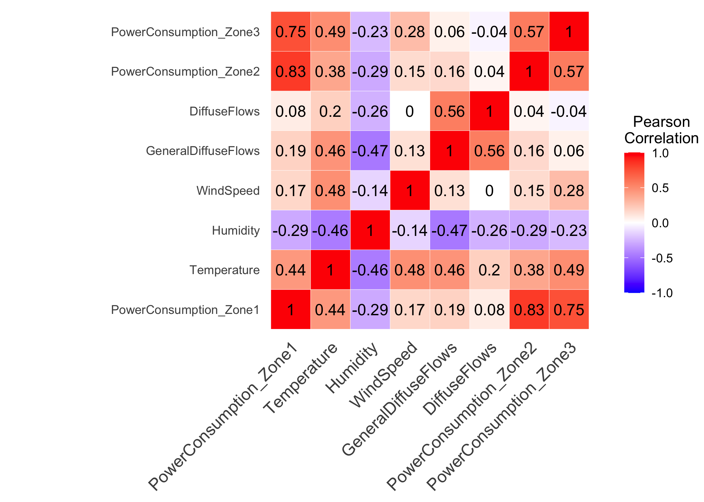
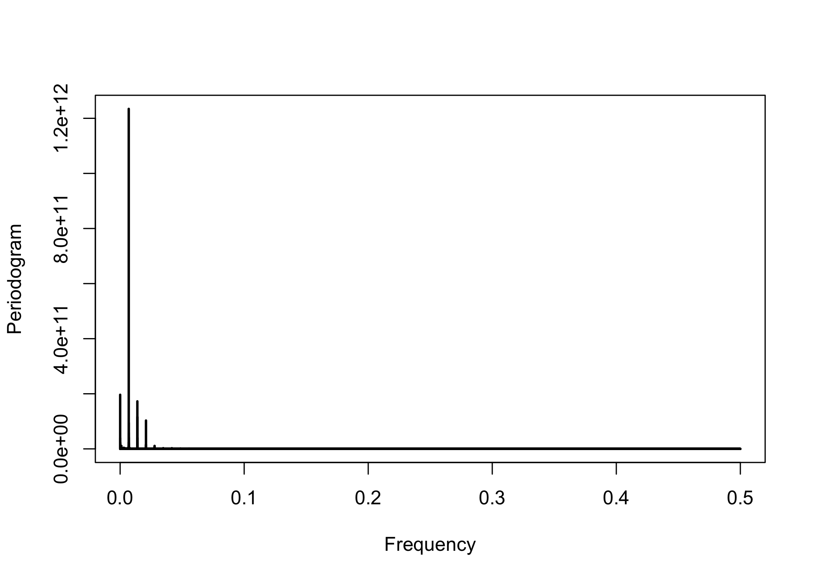

Power Consumption Exploration and Forecasting
================
Eva Burns
2023-05-24

## Problem Statement

A power consumption study in 2017 was done at Tétouan, Morocco by the
Supervisory Control and Data Acquisition System (SCADA) of Amendis, who
is in charge of the distribution of drinking water and electricity.
Energy consumption is very important to the country, so the purpose of
this project is to study and forecast power consumption in Tétouan. The
energy distribution network is powered by 3 Zone stations: Quads, Smir
and Boussafou. In this project, I will only focus on forecasting Zone
1’s (Quads) power consumption.

The data was found from kaggle: [Electric Power
Consumption](https://www.kaggle.com/datasets/fedesoriano/electric-power-consumption)

## Assumptions/Hypotheses about Data and Modeling

The data was collected every ten minutes for exactly one year (1/1/2017
0:00 - 12/30/2017 23:50) with nine columns:

- `Datetime`: Time window of ten minutes.
- `Temperature`: Weather Temperature.
- `Humidity`: Weather Humidity.
- `WindSpeed`: Wind Speed.
- `GeneralDiffuseFlows`: “Diffuse flow” is a catchall term to describe
  low-temperature (\< 0.2° to \~ 100°C) fluids that slowly discharge
  through sulfide mounds, fractured lava flows, and assemblages of
  bacterial mats and macrofauna.
- `Diffuse Flows`
- **`PowerConsumption_Zone1`**: This is what will be forecasted
- `PowerConsumption_Zone2`
- `PowerConsumption_Zone3`

``` r
library(tidyverse)
library(forecast)
library(xts)
library(TSA)
library(tidyquant)
library(tseries)
library(lmtest)
library(car)
library(reshape2)
```

``` r
power <- read.csv("data/powerconsumption.csv")
idx <- which(power$Datetime %in% c('12/1/2017 0:00'))

power$Datetime <- as.POSIXct(power$Datetime, format = "%m/%d/%Y %H:%M")
head(power, 3)
```

    ##              Datetime Temperature Humidity WindSpeed GeneralDiffuseFlows
    ## 1 2017-01-01 00:00:00       6.559     73.8     0.083               0.051
    ## 2 2017-01-01 00:10:00       6.414     74.5     0.083               0.070
    ## 3 2017-01-01 00:20:00       6.313     74.5     0.080               0.062
    ##   DiffuseFlows PowerConsumption_Zone1 PowerConsumption_Zone2
    ## 1        0.119               34055.70               16128.88
    ## 2        0.085               29814.68               19375.08
    ## 3        0.100               29128.10               19006.69
    ##   PowerConsumption_Zone3
    ## 1               20240.96
    ## 2               20131.08
    ## 3               19668.43

``` r
train <- power[1:(idx - 1),]
test <- power[idx:nrow(power),]

train_ts <- ts(train$PowerConsumption_Zone1)
```

Some assumptions about the data collected is that the data was collected
when it is said to be collected. That is, it was collected every ten
minutes a day. Also, that the sensors were calibrated correctly
throughout the year.

I hypothesize that a model with a seasonal component will be most
appropriate. I believe there might be two seasonalities: daily and
yearly. Throughout the day, power consumption changes. For example, when
you are sleeping, power consumption is lower because you are not using
appliances or lights around your house. I also think power consumption
changes yearly as weather changes during the seasons, affecting
AC/heating consumption. However, since this data only covers one year,
yearly seasonality will not be able to be used.

## Data properties

``` r
hist(train$PowerConsumption_Zone1)
```

<!-- -->

The distribution of the power consumption in Zone 1 does not seem to be
normally distributed, but it looks to be somewhat symmetrical.

``` r
acf(ts(train$PowerConsumption_Zone1), xlab = "lag #", ylab = 'ACF',main=' ')
```

<!-- -->

``` r
adf.test(ts(train$PowerConsumption_Zone1))
```

    ## 
    ##  Augmented Dickey-Fuller Test
    ## 
    ## data:  ts(train$PowerConsumption_Zone1)
    ## Dickey-Fuller = -31.572, Lag order = 36, p-value = 0.01
    ## alternative hypothesis: stationary

``` r
kpss.test(ts(train$PowerConsumption_Zone1))
```

    ## 
    ##  KPSS Test for Level Stationarity
    ## 
    ## data:  ts(train$PowerConsumption_Zone1)
    ## KPSS Level = 7.1143, Truncation lag parameter = 18, p-value = 0.01

While the Augmented Dickey-Fuller test gives a low p-value (0.01),
concluding that the data is stationary, the ACF plot and KPSS indicate
the data is non-stationary since the KPSS p-value is 0.01
(non-stationary) and the ACF plot does not die down quickly.

``` r
durbinWatsonTest(train$PowerConsumption_Zone1)
```

    ## [1] 0.0003682608

The Durbin-Watson test indicates that the power consumption in Zone 1 is
positively autocorrelated because the test statistic is close to 0.

## Exploratory Data Analysis

Below is the time series plot of the power consumption in Zone 1 for
2017.

``` r
plot(power$Datetime,power$PowerConsumption_Zone1, type='l', xlab="Month", ylab = "Power Consumption (Zone 1)")
```

<!-- -->

Here is the plot zoomed in on what will be forecasted. It seems that
there is daily seasonality. This will be confirmed later.

``` r
plot(test$Datetime,test$PowerConsumption_Zone1, type='l', xlab="Date", ylab = "Power Consumption (Zone 1)")
```

<!-- -->

Let’s look at how the other features of this dataset correlate to the
power consumption in Zone 1.

``` r
cormat <- round(cor(power[c('PowerConsumption_Zone1', 'Temperature', 'Humidity', 'WindSpeed', 'GeneralDiffuseFlows', 'DiffuseFlows', 'PowerConsumption_Zone2', 'PowerConsumption_Zone3')]),2)

# Get lower triangle of the correlation matrix
get_lower_tri<-function(cormat){
  cormat[upper.tri(cormat)] <- NA
  return(cormat)
}
  # Get upper triangle of the correlation matrix
get_upper_tri <- function(cormat){
  cormat[lower.tri(cormat)]<- NA
  return(cormat)
}

reorder_cormat <- function(cormat){
# Use correlation between variables as distance
dd <- as.dist((1-cormat)/2)
hc <- hclust(dd)
cormat <-cormat[hc$order, hc$order]
}

# Reorder the correlation matrix
cormat <- reorder_cormat(cormat)
upper_tri <- cormat
# Melt the correlation matrix
melted_cormat <- melt(upper_tri, na.rm = TRUE)
# Create a ggheatmap
ggheatmap <- ggplot(melted_cormat, aes(Var2, Var1, fill = value))+
 geom_tile(color = "white")+
 scale_fill_gradient2(low = "blue", high = "red", mid = "white", 
   midpoint = 0, limit = c(-1,1), space = "Lab", 
    name="Pearson\nCorrelation") +
  theme_minimal()+ # minimal theme
 theme(axis.text.x = element_text(angle = 45, vjust = 1, 
    size = 12, hjust = 1))+
 coord_fixed()

ggheatmap + 
geom_text(aes(Var2, Var1, label = value), color = "black", size = 4) +
theme(
  axis.title.x = element_blank(),
  axis.title.y = element_blank(),
  panel.grid.major = element_blank(),
  panel.border = element_blank(),
  panel.background = element_blank(),
  axis.ticks = element_blank(),
  legend.justification = c(1, 0),
  legend.position = c(1.35, 0.1),
  legend.direction = "vertical")+
  guides(fill = guide_colorbar(barwidth = 1, barheight = 7,
                title.position = "top", title.hjust = 0.5))
```

<!-- -->

The power consumption in Zones 2 and 3 are the most correlated with
power consumption in Zones 1. This makes sense because they are
measuring the same thing in a area close to each other. They are
visualized below.

``` r
plot(power$Datetime,power$PowerConsumption_Zone2, type='l')
```

<!-- -->

``` r
plot(power$Datetime,power$PowerConsumption_Zone3, type='l')
```

<!-- -->

## Data processing

Outliers/Anomalies were checked using `tsoutliers`.

``` r
tsoutliers(train$PowerConsumption_Zone1)
```

    ## $index
    ## integer(0)
    ## 
    ## $replacements
    ## numeric(0)

There were no outliers found, so no data needs to be removed or
replaced.

``` r
sum(is.na(power$PowerConsumption_Zone1))
```

    ## [1] 0

The data is full and collected at regular intervals with no null values,
so no cleaning or transformations are required.

## Feature Engineering

Since I suspect that there is a seasonal component to the data, I will
apply a frequency periodogram to `PowerConsumption_Zone1` to determine
if/what the seasonal period is.

``` r
p <- periodogram(train_ts)
```

<!-- -->

The periodogram indicates that there seems to be a seasonal component to
the data. I will calculate the period of seasonality.

``` r
max_freq <- p$freq[which.max(p$spec)]
seasonality <- 1/max_freq
seasonality
```

    ## [1] 144.2136

The periodogram says the seasonality with the highest frequency is
144.2136499. This indicates there is daily seasonality because the data
is collected in 10 minute increments. There are 1440 minutes in a day,
which divided by 10 minutes is 144.

## Proposed Approaches

For this project, I will try two different models: TBATS and SARIMA. I
will discuss how I chose these two models.

``` r
if (file.exists("tbats.rds")) {
  model <- readRDS("tbats.rds")
} else {
  model <- tbats(train_ts, seasonal.periods = c(144))
  saveRDS(model, "tbats.rds")
}

model
```

    ## TBATS(0.702, {0,0}, 1, {<144,7>})
    ## 
    ## Call: tbats(y = train_ts, seasonal.periods = c(144))
    ## 
    ## Parameters
    ##   Lambda: 0.702036
    ##   Alpha: 1.120129
    ##   Beta: 6.237257e-06
    ##   Damping Parameter: 1
    ##   Gamma-1 Values: 0.03611686
    ##   Gamma-2 Values: 0.04283333
    ## 
    ## Seed States:
    ##                [,1]
    ##  [1,]  2.132541e+03
    ##  [2,] -1.146798e-01
    ##  [3,]  5.693147e-02
    ##  [4,]  7.394450e-01
    ##  [5,] -5.295735e-01
    ##  [6,] -1.824285e-01
    ##  [7,]  1.135769e-01
    ##  [8,]  2.740536e-02
    ##  [9,] -3.969776e-02
    ## [10,] -1.295092e+00
    ## [11,] -7.173343e-01
    ## [12,] -1.312209e-01
    ## [13,] -3.491800e-02
    ## [14,]  6.409723e-03
    ## [15,] -5.079506e-02
    ## [16,] -1.762954e-02
    ## attr(,"lambda")
    ## [1] 0.7020363
    ## 
    ## Sigma: 18.85746
    ## AIC: 1098263

``` r
fc <- forecast(model, h=nrow(test))
comp <- tbats.components(model)

power %>%
  ggplot(aes(x = Datetime, y = PowerConsumption_Zone1, color='Actual')) +
  geom_line() +
  geom_line(data = test, mapping = 
              aes(x = Datetime, y = fc$mean, color="Predicted")) +
  scale_color_manual(name = "Group",
  values = c( "Actual" = "black", "Predicted" = "red"),
  labels = c("Actual", "Predicted")) + 
  coord_x_datetime(xlim = c("2017-10-01 00:00:00", "2017-12-30 23:50:00"))
```

    ## Warning: Removed 6 rows containing missing values (`geom_line()`).

<!-- -->

``` r
test %>%
  ggplot(aes(x = Datetime, y = PowerConsumption_Zone1, color='Actual')) +
  geom_line() +
  geom_line(data = test, mapping = 
              aes(x = Datetime, y = fc$mean, color="Predicted")) +
  scale_color_manual(name = "Group",
  values = c( "Actual" = "black", "Predicted" = "red"),
  labels = c("Actual", "Predicted"))
```

<!-- -->

``` r
plot(comp)
```

<!-- -->

``` r
acc <- data.frame(accuracy(fc, test$PowerConsumption_Zone1)[2,1:5])
accuracy(fc, test$PowerConsumption_Zone1)
```

    ##                       ME     RMSE       MAE         MPE      MAPE      MASE
    ## Training set    1.848367  415.548  261.1831 -0.00338068  0.819197 0.5987382
    ## Test set     2686.642378 4040.971 3356.5296  8.96224254 11.602337 7.6945337
    ##                    ACF1
    ## Training set 0.03114879
    ## Test set             NA

``` r
train_ts <- ts(train$PowerConsumption_Zone1, frequency = 144)

if (file.exists("sarima.rds")) {
  model_2 <- readRDS("sarima.rds")
} else {
  model_2 <- tbats(train_ts, seasonal.periods = c(144))
  saveRDS(model_2, "sarima.rds")
}

model_2
```

    ## Series: train_ts 
    ## ARIMA(3,0,0)(0,1,0)[144] 
    ## 
    ## Coefficients:
    ##          ar1      ar2     ar3
    ##       1.0490  -0.1568  0.0831
    ## s.e.  0.0046   0.0066  0.0046
    ## 
    ## sigma^2 = 197086:  log likelihood = -360341.6
    ## AIC=720691.2   AICc=720691.2   BIC=720726.3

``` r
fc_2 <- forecast(model_2, h=nrow(test))


power %>%
  ggplot(aes(x = Datetime, y = PowerConsumption_Zone1, color='Actual')) +
  geom_line() +
  geom_line(data = test, mapping = 
              aes(x = Datetime, y = fc_2$mean, color="Predicted")) +
  scale_color_manual(name = "Group",
  values = c( "Actual" = "black", "Predicted" = "red"),
  labels = c("Actual", "Predicted")) + 
  coord_x_datetime(xlim = c("2017-10-01 00:00:00", "2017-12-30 23:50:00"))
```

    ## Warning: Removed 6 rows containing missing values (`geom_line()`).

<!-- -->

``` r
test %>%
  ggplot(aes(x = Datetime, y = PowerConsumption_Zone1, color='Actual')) +
  geom_line() +
  geom_line(data = test, mapping = 
              aes(x = Datetime, y = fc_2$mean, color="Predicted")) +
  scale_color_manual(name = "Group",
  values = c( "Actual" = "black", "Predicted" = "red"),
  labels = c("Actual", "Predicted"))
```

<!-- -->

``` r
acc[2] <- accuracy(fc_2, test$PowerConsumption_Zone1)[2,1:5]
accuracy(fc_2, test$PowerConsumption_Zone1)
```

    ##                        ME      RMSE       MAE         MPE      MAPE      MASE
    ## Training set     0.336313  443.2652  268.7005 -0.01046387 0.8558852 0.6159709
    ## Test set     -1218.152056 1865.8425 1423.8752 -4.89632554 5.4904169 3.2641022
    ##                       ACF1
    ## Training set -0.0007342209
    ## Test set                NA

``` r
colnames(acc) <- c("TBATS", "SARIMA")
acc <- t(acc)
acc
```

    ##               ME     RMSE      MAE       MPE      MAPE
    ## TBATS   2686.642 4040.971 3356.530  8.962243 11.602337
    ## SARIMA -1218.152 1865.843 1423.875 -4.896326  5.490417
