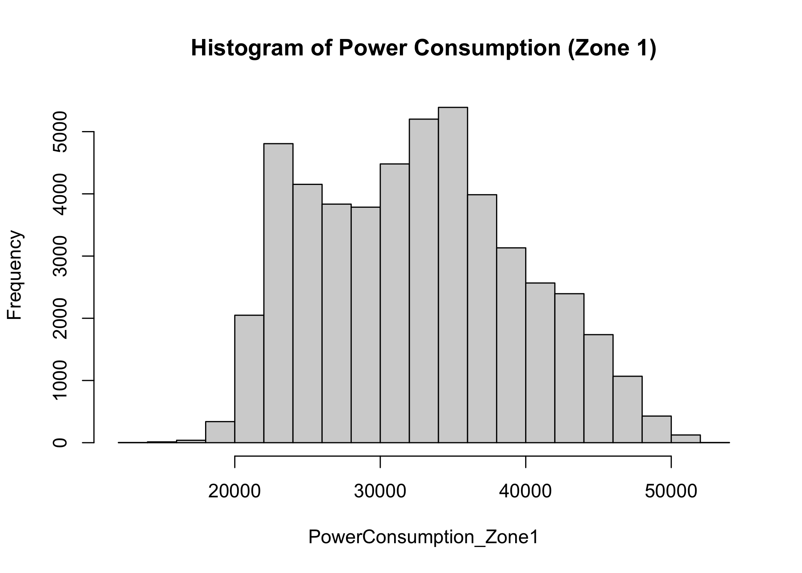

Power Consumption Exploration and Forecasting
================
Eva Burns
2023-05-25

## Problem Statement

A power consumption study in 2017 was done at Tétouan, Morocco by the
Supervisory Control and Data Acquisition System (SCADA) of Amendis, who
is in charge of the distribution of drinking water and electricity.
Energy consumption is very important to the country, so the purpose of
this project is to study and forecast power consumption in Tétouan. The
energy distribution network is powered by 3 Zone stations: Quads, Smir
and Boussafou. In this project, I will only focus on forecasting Zone
1’s (Quads) power consumption. I will be forecasting the last 20 days of
December, 2017 starting on 12/11/2017

The data was found from kaggle: [Electric Power
Consumption](https://www.kaggle.com/datasets/fedesoriano/electric-power-consumption)

## Assumptions/Hypotheses about Data and Modeling

The data was collected every ten minutes for exactly one year (1/1/2017
0:00 - 12/30/2017 23:50) with nine columns:

- `Datetime`: Time window of ten minutes.
- `Temperature`: Weather Temperature.
- `Humidity`: Weather Humidity.
- `WindSpeed`: Wind Speed.
- `GeneralDiffuseFlows`: “Diffuse flow” is a catchall term to describe
  low-temperature (\< 0.2° to \~ 100°C) fluids that slowly discharge
  through sulfide mounds, fractured lava flows, and assemblages of
  bacterial mats and macrofauna.
- `Diffuse Flows`
- **`PowerConsumption_Zone1`**: This is what will be forecasted
- `PowerConsumption_Zone2`
- `PowerConsumption_Zone3`

``` r
library(tidyverse)
library(forecast)
library(xts)
library(TSA)
library(tidyquant)
library(tseries)
library(lmtest)
library(car)
library(reshape2)
```

``` r
power <- read.csv("data/powerconsumption.csv")
idx <- which(power$Datetime %in% c('12/11/2017 0:00'))

power$Datetime <- as.POSIXct(power$Datetime, format = "%m/%d/%Y %H:%M")
head(power, 3)
```

    ##              Datetime Temperature Humidity WindSpeed GeneralDiffuseFlows
    ## 1 2017-01-01 00:00:00       6.559     73.8     0.083               0.051
    ## 2 2017-01-01 00:10:00       6.414     74.5     0.083               0.070
    ## 3 2017-01-01 00:20:00       6.313     74.5     0.080               0.062
    ##   DiffuseFlows PowerConsumption_Zone1 PowerConsumption_Zone2
    ## 1        0.119               34055.70               16128.88
    ## 2        0.085               29814.68               19375.08
    ## 3        0.100               29128.10               19006.69
    ##   PowerConsumption_Zone3
    ## 1               20240.96
    ## 2               20131.08
    ## 3               19668.43

``` r
train <- power[1:(idx - 1),]
test <- power[idx:nrow(power),]

train_ts <- ts(train$PowerConsumption_Zone1)
```

Some assumptions about the data collected is that the data was collected
when it is said to be collected. That is, it was collected every ten
minutes a day. Also, that the sensors were calibrated correctly
throughout the year.

I hypothesize that a model with a seasonal component will be most
appropriate. I believe there might be two seasonalities: daily and
yearly. Throughout the day, power consumption changes. For example, when
you are sleeping, power consumption is lower because you are not using
appliances or lights around your house. I also think power consumption
changes yearly as weather changes during the seasons, affecting
AC/heating consumption. However, since this data only covers one year,
yearly seasonality will not be able to be used.

## Data properties

``` r
hist(train$PowerConsumption_Zone1, main = "Histogram of Power Consumption (Zone 1)", xlab = "PowerConsumption_Zone1")
```

<!-- -->

The distribution of the power consumption in Zone 1 does not seem to be
normally distributed, but it looks to be somewhat symmetrical.

``` r
acf(ts(train$PowerConsumption_Zone1), xlab = "lag #", ylab = 'ACF',main=' ')
```

<!-- -->

``` r
adf.test(ts(train$PowerConsumption_Zone1))
```

    ## 
    ##  Augmented Dickey-Fuller Test
    ## 
    ## data:  ts(train$PowerConsumption_Zone1)
    ## Dickey-Fuller = -31.671, Lag order = 36, p-value = 0.01
    ## alternative hypothesis: stationary

``` r
kpss.test(ts(train$PowerConsumption_Zone1))
```

    ## 
    ##  KPSS Test for Level Stationarity
    ## 
    ## data:  ts(train$PowerConsumption_Zone1)
    ## KPSS Level = 6.6849, Truncation lag parameter = 18, p-value = 0.01

While the Augmented Dickey-Fuller test gives a low p-value (0.01),
concluding that the data is stationary, the ACF plot and KPSS indicate
the data is non-stationary since the KPSS p-value is 0.01
(non-stationary) and the ACF plot does not die down quickly.

``` r
durbinWatsonTest(train$PowerConsumption_Zone1)
```

    ## [1] 0.0003669919

The Durbin-Watson test indicates that the power consumption in Zone 1 is
positively autocorrelated because the test statistic is close to 0.

## Exploratory Data Analysis

Below is the time series plot of the power consumption in Zone 1 for
2017.

``` r
plot(power$Datetime,power$PowerConsumption_Zone1, type='l', xlab="Month", ylab = "Power Consumption (Zone 1)")
```

<!-- -->

Here is the plot zoomed in on what will be forecasted. It seems that
there is daily seasonality. This will be confirmed later.

``` r
plot(test$Datetime,test$PowerConsumption_Zone1, type='l', xlab="Date", ylab = "Power Consumption (Zone 1)")
```

<!-- -->

Let’s look at how the other features of this dataset correlate to the
power consumption in Zone 1.

``` r
cormat <- round(cor(power[c('PowerConsumption_Zone1', 'Temperature', 'Humidity', 'WindSpeed', 'GeneralDiffuseFlows', 'DiffuseFlows', 'PowerConsumption_Zone2', 'PowerConsumption_Zone3')]),2)

# Melt the correlation matrix
melted_cormat <- melt(cormat, na.rm = TRUE)
# Create a ggheatmap
ggheatmap <- ggplot(melted_cormat, aes(Var2, Var1, fill = value))+
 geom_tile(color = "white")+
 scale_fill_gradient2(low = "blue", high = "red", mid = "white", 
   midpoint = 0, limit = c(-1,1), space = "Lab", 
    name="Pearson\nCorrelation") +
  theme_minimal()+ # minimal theme
 theme(axis.text.x = element_text(angle = 45, vjust = 1, 
    size = 12, hjust = 1))+
 coord_fixed()

ggheatmap + 
geom_text(aes(Var2, Var1, label = value), color = "black", size = 4) +
theme(
  axis.title.x = element_blank(),
  axis.title.y = element_blank(),
  panel.grid.major = element_blank(),
  panel.border = element_blank(),
  panel.background = element_blank(),
  axis.ticks = element_blank(),
  legend.justification = c(1, 0),
  legend.position = c(1.35, 0.1),
  legend.direction = "vertical")+
  guides(fill = guide_colorbar(barwidth = 1, barheight = 7,
                title.position = "top", title.hjust = 0.5))
```

<!-- -->

The power consumption in Zones 2 and 3 are the most correlated with
power consumption in Zones 1. This makes sense because they are
measuring the same thing in a area close to each other. They are
visualized below.

``` r
plot(power$Datetime,power$PowerConsumption_Zone2, type='l', xlab="Month", ylab = "Power Consumption (Zone 2)")
```

<!-- -->

``` r
plot(power$Datetime,power$PowerConsumption_Zone3, type='l', xlab="Month", ylab = "Power Consumption (Zone 3)")
```

<!-- -->

## Data processing

Outliers/Anomalies were checked using `tsoutliers`.

``` r
tsoutliers(train$PowerConsumption_Zone1)
```

    ## $index
    ## integer(0)
    ## 
    ## $replacements
    ## numeric(0)

There were no outliers found, so no data needs to be removed or
replaced.

``` r
sum(is.na(power$PowerConsumption_Zone1))
```

    ## [1] 0

The data is full and collected at regular intervals with no null values,
so no cleaning or transformations are required.

## Feature Engineering

Since I suspect that there is a seasonal component to the data, I will
apply a frequency periodogram to `PowerConsumption_Zone1` to determine
if/what the seasonal period is.

``` r
p <- periodogram(train_ts)
```

<!-- -->

The periodogram indicates that there seems to be a seasonal component to
the data. I will calculate the period of seasonality.

``` r
max_freq <- p$freq[which.max(p$spec)]
seasonality <- 1/max_freq
seasonality
```

    ## [1] 144.0922

The periodogram says the seasonality with the highest frequency is
144.092219. This indicates there is daily seasonality because the data
is collected in 10 minute increments. There are 1440 minutes in a day,
which divided by 10 minutes is 144.

## Proposed Approaches

For this project, I will try two different models: TBATS and SARIMA. I
will discuss how I chose these two models.

The main feature I wanted to include in a model to forecast the power
consumption is seasonality, so I gravitated towards TBATS and SARIMA.
TBATS has a lot of features that are spelled out in the name:

**T**rigonometric regressors to model multiple-seasonalities

**B**ox-Cox transformations

**A**RMA errors

**T**rend

**S**easonality

However, because it is a more complex model, there is risk of
overfitting the train data, as well as the model itself being
computationally expensive.

SARIMA also handles seasonality, but is a simpler model. This will make
the time to create the model faster, and may help with overfitting.

I decided not to include dynamic regression (i.e. using any independent
variables to predict power consumption) because the variables that are
most correlated with power consumption (Zone 1) are the power
consumptions of the other zones. Using those other zones does not make
sense for the business case of forecasting power consumption because
these models could also be used to forecast power consumption in zones 1
and 2.

### TBATS

I will first build the TBATS model using the train data (1/1/2017
00:00 - 12/10/2017 23:50) with a seasonal period of 144.

``` r
if (file.exists("tbats.rds")) {
  tbats_model <- readRDS("tbats.rds")
} else {
  # build model if not done already
  tbats_model <- tbats(train_ts, seasonal.periods = c(144))
  saveRDS(tbats_model, "tbats.rds")
}

tbats_model
```

    ## TBATS(1, {0,0}, 0.957, {<144,7>})
    ## 
    ## Call: tbats(y = train_ts, seasonal.periods = c(144))
    ## 
    ## Parameters
    ##   Alpha: 1.392845
    ##   Beta: -0.05513195
    ##   Damping Parameter: 0.957213
    ##   Gamma-1 Values: 0.001440961
    ##   Gamma-2 Values: 0.01914047
    ## 
    ## Seed States:
    ##              [,1]
    ##  [1,] 33129.19413
    ##  [2,]  -369.16899
    ##  [3,]   477.72571
    ##  [4,]  1708.99052
    ##  [5,] -2234.21420
    ##  [6,]  -663.57668
    ##  [7,]   290.24087
    ##  [8,]    74.08659
    ##  [9,]  -124.78203
    ## [10,] -7651.76912
    ## [11,] -3099.38729
    ## [12,]  -609.05664
    ## [13,]    48.94069
    ## [14,]   118.02597
    ## [15,]  -190.09406
    ## [16,]   -71.88900
    ## 
    ## Sigma: 410.9226
    ## AIC: 1131804

``` r
comp <- tbats.components(tbats_model)
plot(comp)
```

<!-- -->

### SARIMA

I will now build the SARIMA model using the train data (1/1/2017 00:00 -
12/10/2017 23:50) using `auto.arima` with a seasonal frequency of 144.

``` r
train_ts <- ts(train$PowerConsumption_Zone1, frequency = 144)

if (file.exists("sarima.rds")) {
  sarima_model <- readRDS("sarima.rds")
} else {
  # build model if not done already
  sarima_model <- auto.arima(train_ts)
  saveRDS(sarima_model, "sarima.rds")
}

sarima_model
```

    ## Series: train_ts 
    ## ARIMA(3,0,0)(0,1,0)[144] 
    ## 
    ## Coefficients:
    ##          ar1      ar2     ar3
    ##       1.0488  -0.1558  0.0827
    ## s.e.  0.0045   0.0065  0.0045
    ## 
    ## sigma^2 = 193237:  log likelihood = -370675.6
    ## AIC=741359.2   AICc=741359.2   BIC=741394.4

## Results and Learnings

### TBATS

Using the built TBATS model, I will forecast Zone 1’s power consumption
from 12/11/2017 00:00 - 12/31/2017 23:50. This forecast is visualized
below.

``` r
fc_tbats <- forecast(tbats_model, h=nrow(test))

tbat_plot_1 <- power %>%
  ggplot(aes(x = Datetime, y = PowerConsumption_Zone1, color='Actual')) +
  ggtitle("TBATS Forecasted Power Consumption (Zone 1)") + 
  geom_line() +
  geom_line(data = test, mapping = 
              aes(x = Datetime, y = fc_tbats$mean, color="Predicted")) +
  scale_color_manual(name = "Data",
  values = c( "Actual" = "black", "Predicted" = "red"),
  labels = c("Actual", "Predicted")) + 
  coord_x_datetime(xlim = c("2017-10-01 00:00:00", "2017-12-30 23:50:00"))

tbat_plot_2 <- test %>%
  ggplot(aes(x = Datetime, y = PowerConsumption_Zone1, color='Actual')) +
  ggtitle("TBATS Forecasted Power Consumption (Zone 1) Zoomed In") + 
  geom_line() +
  geom_line(data = test, mapping = 
              aes(x = Datetime, y = fc_tbats$mean, color="Predicted")) +
  scale_color_manual(name = "Data",
  values = c( "Actual" = "black", "Predicted" = "red"),
  labels = c("Actual", "Predicted"))

tbat_plot_1
```

<!-- -->

``` r
tbat_plot_2
```

<!-- -->
The accuracy of the model is evaluated using ME, RMSE, MAE, MPE, MAPE,
and MASE.

``` r
acc <- data.frame(accuracy(fc_tbats, test$PowerConsumption_Zone1)[2,1:5])
accuracy(fc_tbats, test$PowerConsumption_Zone1)
```

    ##                       ME      RMSE       MAE          MPE      MAPE      MASE
    ## Training set   0.4745312  410.9226  260.0376 -0.009822855 0.8201103 0.5995595
    ## Test set     674.9799243 1491.0374 1156.1754  1.957271438 3.9087413 2.6657527
    ##                    ACF1
    ## Training set 0.03814442
    ## Test set             NA

### SARIMA

Using the built SARIMA model, I will forecast Zone 1’s power consumption
from 12/11/2017 00:00 - 12/31/2017 23:50. This forecast is visualized
below.

``` r
fc_sarima <- forecast(sarima_model, h=nrow(test))

sarima_plot_1 <- power %>%
  ggplot(aes(x = Datetime, y = PowerConsumption_Zone1, color='Actual')) +
  ggtitle("SARIMA Forecasted Power Consumption (Zone 1)") + 
  geom_line() +
  geom_line(data = test, mapping = 
              aes(x = Datetime, y = fc_sarima$mean, color="Predicted")) +
  scale_color_manual(name = "Data",
  values = c( "Actual" = "black", "Predicted" = "red"),
  labels = c("Actual", "Predicted")) + 
  coord_x_datetime(xlim = c("2017-10-01 00:00:00", "2017-12-30 23:50:00"))

sarima_plot_2 <- test %>%
  ggplot(aes(x = Datetime, y = PowerConsumption_Zone1, color='Actual')) +
  ggtitle("SARIMA Forecasted Power Consumption (Zone 1) Zoomed In") + 
  geom_line() +
  geom_line(data = test, mapping = 
              aes(x = Datetime, y = fc_sarima$mean, color="Predicted")) +
  scale_color_manual(name = "Data",
  values = c( "Actual" = "black", "Predicted" = "red"),
  labels = c("Actual", "Predicted"))

sarima_plot_1
```

<!-- -->

``` r
sarima_plot_2
```

<!-- -->

The accuracy of the model is evaluated using ME, RMSE, MAE, MPE, MAPE,
and MASE.

``` r
acc[2] <- accuracy(fc_sarima, test$PowerConsumption_Zone1)[2,1:5]
accuracy(fc_sarima, test$PowerConsumption_Zone1)
```

    ##                        ME      RMSE       MAE         MPE      MAPE      MASE
    ## Training set    0.1421987  438.9349  266.5961 -0.01120267 0.8519747 0.6146812
    ## Test set     1638.8354981 2377.2326 1802.4324  5.49513482 6.1439359 4.1558045
    ##                       ACF1
    ## Training set -0.0007297583
    ## Test set                NA

### Comparison

``` r
colnames(acc) <- c("TBATS", "SARIMA")
acc <- t(acc)
acc
```

    ##               ME     RMSE      MAE      MPE     MAPE
    ## TBATS   674.9799 1491.037 1156.175 1.957271 3.908741
    ## SARIMA 1638.8355 2377.233 1802.432 5.495135 6.143936

TBATS performed better that SARIMA on all accuracy metrics for the train
set (as in all metrics were closer to zero). For example the RMSE of
TBATS was 1491.0374 compared to the RMSE of SARIMA which was 2377.2326.
It should be noted, though, that the accuracy of the training data on
both models were about equal. This tells us that the SARIMA model is
actually the one that overfit the training data.

## Future Work

While the TBATS model performed better to forecast the last two weeks of
December, the current dataset ignores one of the main capabilities of
the TBATS model: multiple seasonality. As stated earlier, I believe
there is yearly seasonality to this data because of how weather changes
throughout the year. However, this data is only for 2017, so yearly
seasonality cannot be used on this project. If more data from multiple
years were used, the TBATS model could be even more accurate than the
others because it can handle both daily seasonality as well as the
suspected yearly seasonality.

In other words, in the future I believe that collecting more data for
multiple years will yield an even more accurate TBATS model because it
can be built on multiple seasonalities: daily and yearly.
